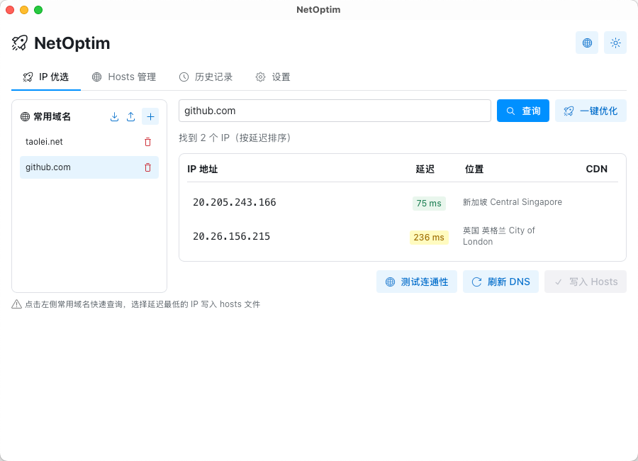
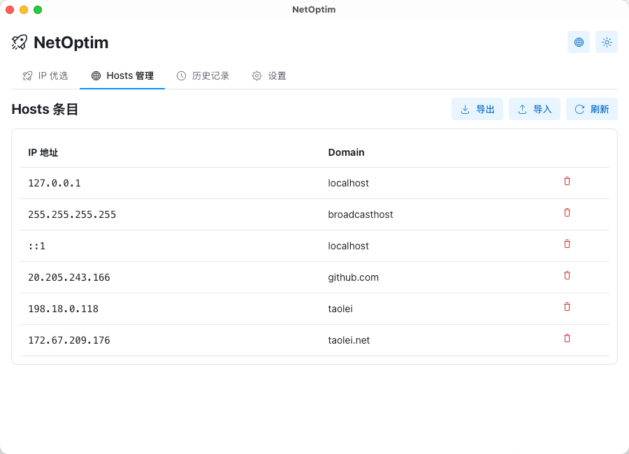
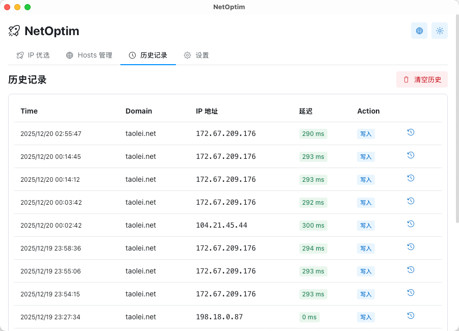
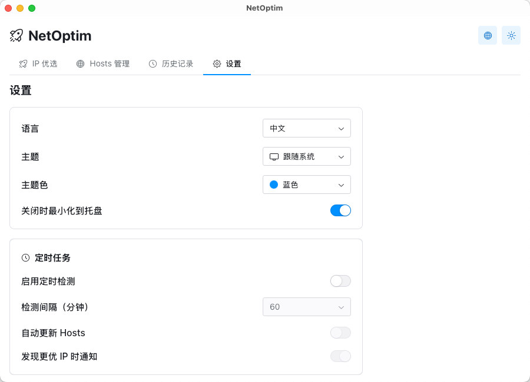

# NetOptim

智能 IP 优选工具 - 通过测速自动选择最快的 IP 地址并写入 hosts 文件，优化网络访问速度。


📖 **文档**：[NetOptim 完全指南](https://taolei.net/articles/05-netoptim_article)

## 功能特性

- **智能 DNS 解析** - 支持多 DNS 服务器并行查询，包括 DoH (DNS over HTTPS)
- **IP 测速优选** - 并行 ping 测试，自动选择延迟最低的 IP
- **Hosts 管理** - 可视化管理 hosts 文件，支持启用/禁用条目
- **预设配置** - 内置常用域名预设（GitHub、Google、Cloudflare 等），支持自定义
- **历史记录** - 记录每次优选结果，方便回溯
- **批量优选** - 一键优化多个域名
- **导入导出** - 支持 hosts 规则的导入导出
- **多语言** - 支持中文和英文界面
- **主题切换** - 支持亮色/暗色主题，跟随系统设置

## 截图

|  |  |
|:---:|:---:|
|  |  |

## 安装

### macOS

下载 `.dmg` 文件，拖拽到 Applications 文件夹即可。

> 首次运行需要授予管理员权限以修改 hosts 文件

### Windows

下载 `.msi` 或 `.exe` 安装包运行安装。

> 需要以管理员身份运行

### Linux

下载 `.deb` 或 `.AppImage` 文件。

```bash
# Debian/Ubuntu
sudo dpkg -i netoptim_*.deb

# AppImage
chmod +x NetOptim_*.AppImage
./NetOptim_*.AppImage
```

## 从源码构建

### 环境要求

- [Node.js](https://nodejs.org/) 18+
- [Rust](https://www.rust-lang.org/) 1.70+
- [Bun](https://bun.sh/) (推荐) 或 npm/yarn

### 构建步骤

```bash
# 克隆仓库
git clone https://github.com/yourusername/NetOptim.git
cd NetOptim

# 安装依赖
bun install

# 开发模式
bun run tauri:dev

# 构建发布版本
bun run tauri:build
```

## 技术栈

- **前端**: React 19 + TypeScript + Radix UI + i18next
- **后端**: Rust + Tauri 2
- **构建**: Vite + Bun

## 项目结构

```
NetOptim/
├── src/                        # 前端源码
│   ├── App.tsx                 # 主应用组件
│   ├── App.css                 # 样式文件
│   ├── types.ts                # TypeScript 类型定义
│   ├── ThemeContext.tsx        # 主题上下文
│   ├── ThemeWrapper.tsx        # 主题包装器
│   ├── i18n/                   # 国际化
│   │   └── index.ts            # i18n 配置
│   ├── main.tsx                # 入口文件
│   └── vite-env.d.ts           # Vite 类型声明
├── src-tauri/                  # 后端 Rust 源码
│   ├── src/
│   │   ├── lib.rs              # 主模块，Tauri 命令
│   │   ├── main.rs             # 程序入口
│   │   ├── dns.rs              # DNS 解析模块
│   │   ├── ping.rs             # Ping 测速模块
│   │   ├── hosts.rs            # Hosts 文件管理
│   │   ├── history.rs          # 历史记录模块
│   │   ├── presets.rs          # 预设管理模块
│   │   ├── scheduler.rs        # 定时任务模块
│   │   ├── ipinfo.rs           # IP 信息查询
│   │   └── i18n.rs             # 设置管理
│   ├── icons/                  # 应用图标
│   ├── capabilities/           # Tauri 权限配置
│   ├── Cargo.toml              # Rust 依赖配置
│   └── tauri.conf.json         # Tauri 配置
├── public/                     # 静态资源
├── screenshots/                # 应用截图
├── package.json                # 前端依赖配置
├── vite.config.ts              # Vite 配置
├── tsconfig.json               # TypeScript 配置
└── README.md
```

## 使用说明

1. **IP 优选**: 在主界面输入域名或选择预设，点击"开始优选"
2. **应用结果**: 优选完成后点击"应用到 Hosts"写入系统 hosts 文件
3. **Hosts 管理**: 在 Hosts 标签页查看和管理所有 hosts 条目
4. **历史记录**: 在历史标签页查看之前的优选记录

## 注意事项

- 修改 hosts 文件需要管理员/root 权限
- 部分网络环境下 ping 可能被防火墙拦截
- 建议定期重新优选以获取最佳 IP

## License

MIT
